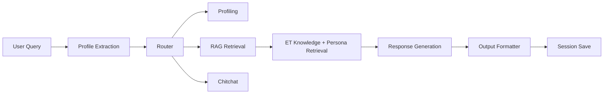
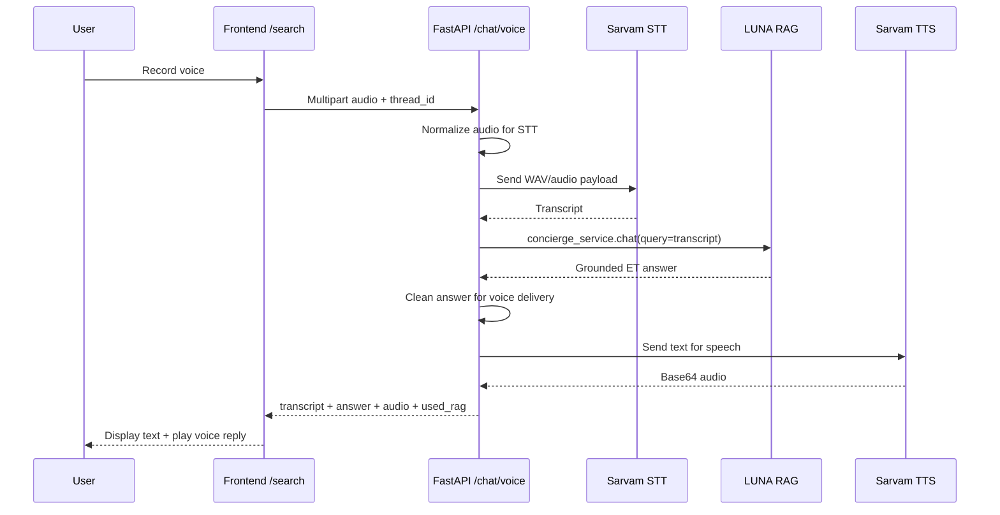

# ET Compass / LUNA for ET

<p align="center">
  
</p>

<p align="center">
  <strong>Complete Build Story, Technical Summary, and Jury Notes</strong><br />
  <em>How Aryan and Ajay built an AI concierge for the Economic Times ecosystem from scratch</em>
</p>

---

> [!IMPORTANT]
> This document is meant to tell the full story of the project to a jury, reviewer, mentor, or technical evaluator.  
> It covers the product vision, architecture, backend/frontend  , RAG stages, vector pipeline, deployment problems, voice integration, and the real technical hurdles we faced while building ET Compass.

---

## Table of Contents

- [1. Executive Summary](#1-executive-summary)
- [2. The Original Problem We Chose To Solve](#2-the-original-problem-we-chose-to-solve)
- [3. What We Actually Built](#3-what-we-actually-built)
- [4. Team Roles And Contribution Split](#4-team-roles-and-contribution-split)
- [5. Product Vision: Why LUNA Is Not Just A Chatbot](#5-product-vision-why-luna-is-not-just-a-chatbot)
- [6. Starting Point: What The Project Looked Like Initially](#6-starting-point-what-the-project-looked-like-initially)
- [7. Frontend And Backend Integration Challenges](#7-frontend-and-backend-integration-challenges)
- [8. The Frontend Story: How The Platform Was Designed](#8-the-frontend-story-how-the-platform-was-designed)
- [9. The Theme, Visual Language, And UI Philosophy](#9-the-theme-visual-language-and-ui-philosophy)
- [10. Core Frontend Surfaces We Built](#10-core-frontend-surfaces-we-built)
- [11. The Search Experience And The LUNA Control Center](#11-the-search-experience-and-the-luna-control-center)
- [12. What The Live Portal / Concierge Rail Actually Shows](#12-what-the-live-portal--concierge-rail-actually-shows)
- [13. Why We Needed RAG Instead Of A Normal LLM Chatbot](#13-why-we-needed-rag-instead-of-a-normal-llm-chatbot)
- [14. Stage 1 RAG: The First Working Concierge Layer](#14-stage-1-rag-the-first-working-concierge-layer)
- [15. Stage 1 Problems: What Was Broken Or Weak Initially](#15-stage-1-problems-what-was-broken-or-weak-initially)
- [16. How We Improved Stage 1 RAG](#16-how-we-improved-stage-1-rag)
- [17. Our ET Knowledge Base: What We Fed To Luna](#17-our-et-knowledge-base-what-we-fed-to-luna)
- [18. Vector Embeddings, Chunking, And Mongo Storage](#18-vector-embeddings-chunking-and-mongo-storage)
- [19. The Ingestion Pipeline: How Raw ET Sources Became Retrieval Data](#19-the-ingestion-pipeline-how-raw-et-sources-became-retrieval-data)
- [20. Hybrid Retrieval: Why We Did Not Rely On Vector Search Alone](#20-hybrid-retrieval-why-we-did-not-rely-on-vector-search-alone)
- [21. Session Memory And User Journey Tracking](#21-session-memory-and-user-journey-tracking)
- [22. How Luna Frames A Real Path For The User](#22-how-luna-frames-a-real-path-for-the-user)
- [23. Stage 1 Evaluation And Why It Mattered](#23-stage-1-evaluation-and-why-it-mattered)
- [24. Stage 2 RAG: The Big Upgrade](#24-stage-2-rag-the-big-upgrade)
- [25. The Response Planner And Unified Decision Object](#25-the-response-planner-and-unified-decision-object)
- [26. Product Scoring: How Luna Chooses The Best ET Path](#26-product-scoring-how-luna-chooses-the-best-et-path)
- [27. Answer/UI Sync: Why The Backend And Frontend Had To Speak The Same Language](#27-answerui-sync-why-the-backend-and-frontend-had-to-speak-the-same-language)
- [28. Format-Aware Rendering: When Luna Uses Bullets, Tables, Roadmaps, And Widgets](#28-format-aware-rendering-when-luna-uses-bullets-tables-roadmaps-and-widgets)
- [29. Performance And Latency Work For Large Roadmap Queries](#29-performance-and-latency-work-for-large-roadmap-queries)
- [30. Voice-AI Journey: How We Integrated Sarvam Without Breaking The RAG](#30-voice-ai-journey-how-we-integrated-sarvam-without-breaking-the-rag)
- [31. End-To-End Voice Flow In The Project](#31-end-to-end-voice-flow-in-the-project)
- [32. Real Deployment Problems We Faced And Solved](#32-real-deployment-problems-we-faced-and-solved)
- [33. Complete Tech Stack](#33-complete-tech-stack)
- [34. Full Feature Inventory](#34-full-feature-inventory)
- [35. Seven Strongest Project Highlights](#35-seven-strongest-project-highlights)
- [36. End-To-End Architecture Summary](#36-end-to-end-architecture-summary)
- [37. Why This Solves The ET Hackathon Problem Well](#37-why-this-solves-the-et-hackathon-problem-well)
- [38. What Makes This Different From A Generic Finance Chatbot](#38-what-makes-this-different-from-a-generic-finance-chatbot)
- [39. Future Scope](#39-future-scope)
- [40. Final Closing Summary](#40-final-closing-summary)

---

## 1. Executive Summary

**ET Compass** is a full-stack AI concierge for the **Economic Times ecosystem**, powered by **LUNA for ET**.

The core idea was not to build a normal chatbot. The goal was to build a guided, profile-aware, ET-grounded assistant that can:

- understand who the user is in one conversation
- map them into the right ET lane
- explain ET products clearly
- guide them through a meaningful path instead of dumping links
- remember what has already been discussed
- optionally surface the right UI block only when it helps
- and now even support **voice input/output** while staying on the same grounded RAG path

The project evolved in multiple stages:

1. **Frontend foundation and branded ET experience**
2. **Backend migration from a basic route into a real LangGraph concierge flow**
3. **Stage 1 RAG with Mongo-backed retrieval and session memory**
4. **ET research-pack integration and validated product routing**
5. **Full ingestion, chunking, embeddings, and larger ET corpus**
6. **Stage 2 RAG with response planning, product scoring, and answer/UI synchronization**
7. **Voice-AI integration with Sarvam on top of the same RAG answer path**

This document tells that story in detail.

---

## 2. The Original Problem We Chose To Solve

The ET hackathon problem statement was essentially this:

> ET has a massive ecosystem — ET Prime, ET Markets, masterclasses, corporate events, wealth summits, and financial services partnerships — but most users discover only a small fraction of it. Build an AI concierge that understands who you are in one conversation and becomes your personal guide to everything ET can do for you.

That immediately implied a few things:

- this was not only about answering questions
- this was not only about finance content
- this was not only about news summarization
- and this was definitely not about a one-shot static FAQ bot

The assistant needed to:

- onboard people naturally
- understand intent
- remember user context
- introduce ET products in the right order
- reduce confusion
- expose more of the ET ecosystem than the user would otherwise find

This shaped every technical decision we made.

---

## 3. What We Actually Built

We built a complete product, not just a backend model.

### User-facing surfaces

- a branded ET landing page
- a responsive `/search` experience for LUNA chat
- a thread history rail
- a right-side concierge control center
- a user profile dashboard
- Firebase login and signup
- a documentation page
- live/contextual UI blocks when relevant
- voice input and voice output

### Backend surfaces

- FastAPI backend
- LangGraph-powered multi-stage concierge flow
- MongoDB-backed session persistence
- Mongo-backed ET knowledge base
- vector embeddings and retrieval
- product registry and source registry
- market snapshot endpoint
- voice endpoint
- evaluation scripts

### Data intelligence layers

- Stage 1 ET product/source pack
- hybrid retrieval
- verification-aware answers
- session memory
- Stage 2 response planner
- unified decision object
- product scoring
- answer-style routing
- UI module hints

---

## 4. Team Roles And Contribution Split

### Aryan  
GitHub: **[@Aryan-coder06](https://github.com/Aryan-coder06)**

Aryan handled the broader **platformization** of the project.

His work included:

- building the full ET Compass platform surface
- restructuring and cleaning the landing page
- designing and implementing the complete responsive UI infrastructure
- connecting frontend and backend end to end
- integrating Firebase auth
- integrating profile dashboard, docs, thread rails, and concierge rail
- aligning answer rendering with backend response contracts
- improving search UX, widgets, loaders, intro video, and layout behavior
- merging additional features like Voice-AI into the main project without regressing the RAG stack
- managing deployment behavior and frontend/backend integration in real environments

In short: **Aryan turned the project into a real deployable product experience.**

### Ajay  
GitHub: **[@ajaykathar30](https://github.com/ajaykathar30)**

Ajay handled the **RAG foundation and retrieval backbone**.

His work included:

- creating the original RAG direction from scratch
- establishing MongoDB-backed session persistence
- setting up ET retrieval pathways
- building hybrid retrieval logic
- helping shape the knowledge-grounded ET concierge flow
- structuring the foundation that later became Stage 1 and Stage 2 RAG

In short: **Ajay created the initial retrieval and memory backbone that allowed LUNA to become grounded instead of generic.**

### Combined impact

The strongest outcome came from combining:

- **Ajay’s RAG and persistence foundation**
- with **Aryan’s platform integration, UX, orchestration, and later-stage RAG refinement**

That is what turned the system into a real ET concierge instead of just a backend demo.

---

## 5. Product Vision: Why LUNA Is Not Just A Chatbot

LUNA is intentionally built as an **AI concierge**, not a generic “financial Q&A” interface.

The distinction matters:

| Plain chatbot | LUNA for ET |
| --- | --- |
| answers isolated questions | guides the user through ET lanes |
| behaves the same for every user | adapts to intent, sophistication, and goal |
| gives fluent answers | gives grounded ET-specific guidance |
| has no memory | remembers session path and profile |
| shows the same UI every time | selectively uses UI modules only when useful |
| can drift off-brand | stays anchored to ET product structure |

This changed our design philosophy from:

> “How do we answer?”

to:

> “How do we guide?”

That is the real product leap.

---

## 6. Starting Point: What The Project Looked Like Initially

When we started, the project was not yet a full concierge platform.

### Early frontend state

- the landing page was large and chunky
- important content lived inside a single route file
- branding and product framing were not fully ET-specific
- the UX existed, but the platform identity was not yet sharp

### Early backend state

- the backend was initially much closer to a simple route layer than a real concierge engine
- there was no mature LangGraph pipeline wired cleanly into the frontend
- ET product knowledge was not yet shaped into a verified structure
- the RAG could respond, but not with the consistency, route-awareness, or product guidance we needed

### Core challenge

We had to evolve the codebase from:

- a product prototype

into:

- a connected, grounded, responsive, multi-surface ET concierge

That required changes in both architecture and data.

---

## 7. Frontend And Backend Integration Challenges

One of the biggest practical challenges was not model quality first. It was **integration reliability**.

### Problems we faced

#### 1. Production frontend was sometimes calling localhost

At one point the deployed Vercel frontend still tried to call:

```text
http://127.0.0.1:8000
```

instead of the Render backend.

That happened because:

- `NEXT_PUBLIC_API_BASE_URL` was build-time baked
- a production fallback was too permissive
- environment changes alone were not enough without redeploy

### 2. CORS mismatches

We had to correctly configure:

- Vercel frontend origin
- Render backend CORS
- env-driven `ALLOWED_ORIGINS`

The trailing slash issue on allowed origins was one subtle source of confusion.

### 3. Missing backend data pack on deployment

The backend worked locally but initially crashed in production because:

- the Stage 1 ET data pack was not shipped due to `.gitignore`
- `/health` could still look fine
- but `/chat` failed because registry files were missing

This was a classic “service is up but the real dependency is absent” problem.

### 4. Session fetch confusion

When `/chat` failed, frontend continued to request `/sessions/{thread_id}`.

That produced `404`, which looked like another bug, but it was actually a symptom:

- chat failed first
- therefore no session was persisted
- therefore the session fetch correctly returned “not found”

### 5. Voice-AI multipart/STT incompatibility

Browser voice recording produced formats like:

- `webm`
- `ogg`

But Sarvam STT rejected the raw browser upload with `400`.

That forced us to normalize audio server-side before transcription.

---

## 8. The Frontend Story: How The Platform Was Designed

The frontend was not treated as a decorative shell. It was treated as the **user’s experience of the concierge logic**.

### Important frontend principles we followed

- keep the interface bold and branded
- avoid generic SaaS styling
- make the platform feel intentional and product-led
- preserve clarity even when the backend response becomes richer
- let the UI reveal guidance without overwhelming the user

### Structural improvements we made

- split large page files into reusable components
- moved content/config into dedicated data modules
- created a consistent design language across landing, auth, search, profile, and docs
- ensured the app works as a real product shell, not just a static demo

### Major frontend surfaces

- `HomePage`
- `Search Page`
- `Thread Rail`
- `Concierge Rail`
- `Profile Dashboard`
- `Login / Signup`
- `Docs Page`
- `Voice Chat Button`
- `Luna Thinking Panel`
- `Response Insight Panels`

---

## 9. The Theme, Visual Language, And UI Philosophy

The UI intentionally follows a **bold editorial / neo-brutalist ET-inspired direction**.

### Theme ingredients

- light background: `#F0F0F0`
- dark ink text: `#121212`
- ET-inspired accents:
  - red `#D02020`
  - blue `#1040C0`
  - yellow `#F0C020`
- heavy black borders
- offset box shadows
- uppercase typography for labels and navigation
- strong editorial hierarchy in headings
- `Outfit` font for clean but expressive readability

### Why this theme was chosen

The project needed to feel:

- editorial, like ET
- product-focused, not playful in the wrong way
- strong enough for a jury/demo
- visually distinct from commodity chatbot dashboards

### Motion philosophy

We used motion selectively:

- loading animation
- dotted path animation in “How Luna Works”
- line/trace animations
- hover state transitions
- intro video

The rule was:

> animate when it adds product meaning, not just because motion is available.

---

## 10. Core Frontend Surfaces We Built

### 1. Landing page

The landing page communicates:

- ET Compass as the platform
- LUNA for ET as the assistant
- the ecosystem map
- ET lane discovery
- the concierge product narrative

### 2. Search page

The search page is the main operating surface of LUNA.

It includes:

- thread history
- active conversation
- suggested prompt chips
- structured response rendering
- selective widgets
- voice button
- control center side rail

### 3. Profile dashboard

This page exists because the user profile became too important to keep squeezed into the chat sidebar.

It gives a cleaner view of:

- persona
- goal
- current lane
- journey state
- recent path logic

### 4. Documentation page

This page explains:

- the build
- the team roles
- the RAG concepts
- platform architecture

This mattered because the system became complex enough that the jury needed a clear product + technical interpretation layer.

### 5. Auth pages

We added:

- Firebase signup
- Firebase login
- persisted signed-in state
- profile-linked UI changes on the landing page

---

## 11. The Search Experience And The LUNA Control Center

The `/search` route is where the project becomes a real concierge.

It is divided into three conceptual regions:

| Region | Purpose |
| --- | --- |
| Left rail | thread history and thread actions |
| Center | main conversation area |
| Right rail | concierge intelligence and quick access |

### Why we made this split

Originally the sidebar was overloaded. Too much profile data and too much history competed for space.

We reorganized it so the experience is now:

- **left** = conversation continuity
- **center** = response clarity
- **right** = concierge guidance layer

That separation made the whole system much more understandable.

---

## 12. What The Live Portal / Concierge Rail Actually Shows

The right-side **LUNA Control Center** is not random UI. It is the live assistant context layer.

It can show:

### 1. Profile Snapshot

Current view of:

- persona
- goal
- lane
- onboarding state

### 2. Quick Access

Fast links into key ET surfaces such as:

- ET Prime
- ET Markets
- ET Portfolio
- ET Masterclass

### 3. Live Context

A dynamic module based on the active query.

Examples:

- if the user is asking about markets:
  - Sensex
  - Nifty
  - Gold
  - Market Mood
  - Markets Tracker
  - ET Portfolio path

- if the user is asking about ecosystem fit:
  - best ET starting point
  - product lane highlights

- if the user is asking about a structured lane:
  - the right ET route in focus

### 4. Next Best Action

The backend can suggest what to do next instead of leaving the user at a dead end.

This is critical to the concierge idea because the assistant should not only answer:

it should move the user forward.

---

## 13. Why We Needed RAG Instead Of A Normal LLM Chatbot

The ET problem is dangerous for a plain LLM because ET is a **specific ecosystem**, not a general topic.

A generic LLM alone would:

- confidently invent ET features
- mix ET with internet-wide knowledge
- miss product boundaries
- confuse benefits, plans, tools, and portals
- fail to track the user’s journey through the ecosystem

RAG was necessary so that LUNA could answer from:

- ET product registry
- ET source pages
- ET tool pages
- ET event portals
- ET benefits data
- ET print/wealth/masterclass pages

In simple terms:

> RAG gave LUNA memory of ET itself, not just language fluency.

---

## 14. Stage 1 RAG: The First Working Concierge Layer

Stage 1 was the first serious version of the ET concierge.

Its goal was:

- get the backend connected
- retrieve ET knowledge
- answer user questions with grounding
- ask profiling questions only when necessary
- save sessions and user path

### Stage 1 pipeline



### What Stage 1 already supported

- natural ET questions
- profile extraction
- ET product discovery
- hybrid retrieval
- session memory
- recommendations
- citations
- roadmap generation
- verified ET explanations

### Why Stage 1 mattered

This is where the project stopped being a static product shell and became a real ET assistant.

---

## 15. Stage 1 Problems: What Was Broken Or Weak Initially

Even once Stage 1 was live, it still had important weaknesses.

### Problem 1: weak retrieval on broad questions

Questions like:

- “What ET products do you offer?”
- “Where should I start?”
- “What is the ET ecosystem?”

needed a broad product-aware answer, but a simple one-shot vector query was not enough.

### Problem 2: profile over-inference

The system sometimes guessed profile fields too aggressively.

That polluted user state with things the user never truly said.

### Problem 3: persona leakage into broad product responses

Sometimes broad product questions pulled in persona journey data too early.

That made answers feel strange or overly prescriptive.

### Problem 4: inconsistent routing

Some queries were clearly asking for ET product help, but the model routed them into profiling instead of answering directly.

### Problem 5: answer text formatting issues

The frontend sometimes showed markdown markers directly, like `**bold**`, which looked messy.

### Problem 6: weak provenance visibility

The backend had richer knowledge, but the frontend initially surfaced only a simplified answer layer.

---

## 16. How We Improved Stage 1 RAG

We solved those weaknesses through several focused improvements.

### 1. Better query understanding

We added:

- query normalization
- product alias detection
- intent hints
- topic-term extraction
- multiple query variants

This made retrieval stronger for both broad and messy questions.

### 2. Hybrid retrieval

We did not rely only on vector similarity.

We combined:

- vector search
- product detection
- keyword cues
- profile signals
- reranking

### 3. Smarter reranking

Documents were scored using:

- direct product mentions
- intent tags
- profession/persona fit
- priority
- source tier
- verification status

### 4. Safer profile inference

We stopped treating every question as profile information.

That made the system feel less intrusive and more real.

### 5. Cleaner responses

We stripped markdown noise and tightened answer rules so the frontend looked professional.

### 6. Broader overview handling

All-products and ecosystem questions began using better retrieval coverage and product routing instead of generic fallback behavior.

---

## 17. Our ET Knowledge Base: What We Fed To Luna

LUNA is grounded in ET-specific product and source data.

### Canonical ET product lanes fed into Luna

1. **ET Prime**
2. **ET Markets**
3. **ET Portfolio**
4. **ET Wealth Edition**
5. **ET Print Edition**
6. **ET Masterclass**  
   internal canonical form: `ETMasterclass`
7. **ET Events**
8. **ET Partner Benefits**

### Important aliases Luna understands

- `masterclass` -> `ETMasterclass`
- `ET benefits` -> `ET Partner Benefits`
- `Times Prime` -> `ET Partner Benefits`
- `wealth edition` -> `ET Wealth Edition`
- `print edition` / `epaper` -> `ET Print Edition`

### Types of ET source content we used

- FAQ pages
- about pages
- membership plans pages
- app store listings
- tool pages
- portfolio pages
- edition pages
- benefits pages
- events portal pages
- masterclass pages
- curated bootstrap chunks

### Why this mattered

It allowed Luna to answer in terms of:

- ET lanes
- ET benefits
- ET tools
- ET access paths
- ET journeys

instead of generic finance or generic “news app” answers.

---

## 18. Vector Embeddings, Chunking, And Mongo Storage

This was one of the most important technical foundations of the project.

### Why embeddings were necessary

We wanted users to ask natural questions like:

- “What ET product is right for me?”
- “How do I track my holdings?”
- “What benefits come with ET Prime besides articles?”
- “How do ET Markets and ET Portfolio connect?”

These cannot be solved well with only keyword lookup.

We needed semantic search over ET knowledge.

### How we did it

We used:

- **Google Generative AI Embeddings**
- **MongoDB Atlas Vector Search**

### Storage model

Knowledge was stored inside Mongo collections such as:

- `knowledge_base`
- `persona_base`
- `sessions`

Each knowledge chunk stored:

- `source_id`
- `title`
- `source_url`
- `text`
- `embedding`
- `product_name`
- `product_area`
- `category`
- `intent_tags`
- `personas`
- `priority`
- `page_type`
- `source_tier`
- `source_of_truth`
- `verification_status`
- `evidence_highlights`

### Why this schema was powerful

It meant each chunk was not just text.  
It was **text + meaning + product role + trust level + routing signals**.

That made later reranking and product guidance much better.

---

## 19. The Ingestion Pipeline: How Raw ET Sources Became Retrieval Data

We did not want the RAG to depend on ad-hoc manual database content forever.

So we built a proper ingestion pipeline.

### Pipeline goals

- load ET source files
- validate them
- split them into chunks
- generate embeddings
- upsert into Mongo
- keep the pipeline repeatable

### What ingestion supports

- JSON and JSONL input
- knowledge records
- persona records
- configurable chunk sizes
- bootstrap chunk pack
- live ET page fetching
- registry-aware source metadata

### Chunking strategy

We used different chunk settings for:

- product knowledge
- persona journeys

because those are different content types.

### Why this was a major upgrade

Without ingestion, improving RAG becomes a manual, fragile process.

With ingestion, the knowledge base becomes:

- extensible
- reproducible
- evaluable
- easier to update

---

## 20. Hybrid Retrieval: Why We Did Not Rely On Vector Search Alone

Pure vector search sounds attractive, but for a concierge product it is not enough.

### Why pure vector search was insufficient

- it can miss explicit product mentions
- it can retrieve semantically similar but wrong ET lanes
- it does not naturally understand trust/verification
- it does not know when a product was explicitly asked for

### Our hybrid retrieval strategy

We combined:

- vector similarity
- keyword/product alias detection
- intent hints
- profile context
- product registry
- reranking logic

### What this achieved

- better direct product routing
- cleaner all-products answers
- better investor/learning/event split
- stronger ET-specific grounding

### In product terms

The difference is:

- **semantic closeness**

versus

- **semantic closeness + ET correctness + product fit**

We needed the second one.

---

## 21. Session Memory And User Journey Tracking

Memory was central to the concierge idea.

### We did not want:

- a stateless one-question bot
- a user repeating the same profile every turn
- no path continuity between threads

### We built:

- session document loading
- session summaries
- conversation history
- `journey_history`
- title generation from first message

### What `journey_history` stores

For each turn, Luna can preserve:

- route used
- user message
- assistant answer
- recommended products
- citations
- verification notes
- profile snapshot
- next-step style guidance

### Why this matters

This is what allows the system to feel like a **guide over time**, not only a single-turn Q&A engine.

---

## 22. How Luna Frames A Real Path For The User

This is the real concierge behavior.

The assistant does not only answer:

> “Here is ET Prime.”

It tries to answer:

> “Given who you are and what you asked, this is the right ET lane, here is why, and here is what you should do next.”

### Path framing logic uses

- the user’s current query
- profile state
- detected ET products
- historical journey
- retrieval context
- product scoring

### Output can include

- best ET starting point
- why that lane fits
- what to use after that
- what to verify before acting
- roadmap steps
- recommended ET surfaces

### Example of path logic

A student asking to learn trading might be guided through:

1. ET Markets for live discovery and tools
2. ET Portfolio for tracking and goals
3. ET Prime for deeper analysis
4. ET Masterclass for structured learning

That is a **path**, not a random answer.

---

## 23. Stage 1 Evaluation And Why It Mattered

We did not want to trust isolated examples.

So we added ET-specific evaluation packs and used them to measure whether the concierge was actually improving.

### What evaluation checked

- route quality
- citation presence
- conflict handling
- basic hallucination safety
- product fit

### Internal measurement progression

At one important point in the journey:

- an earlier full run was around `0.809`
- after major Stage 1 improvements it reached `0.94`
- after remaining routing and citation polish it reached `1.0` on the internal 40-prompt ET pack

### Why this mattered

This meant improvement was not just subjective.  
We had evidence that the system became:

- more grounded
- more consistent
- better routed
- better cited

---

## 24. Stage 2 RAG: The Big Upgrade

Stage 1 made the system work well.  
Stage 2 made it **structured, deliberate, and UI-aware**.

Stage 2 introduced a stronger planning layer between retrieval and final rendering.

### Stage 2 was built around these concepts

- response planner
- unified decision object
- product scoring
- answer/UI sync
- format-aware rendering
- UI module control
- evaluation suite for Stage 2

This was a major maturity step.

---

## 25. The Response Planner And Unified Decision Object

Stage 2 stopped treating answer generation as:

> retrieve chunks -> dump them into the model -> hope for the best

Instead, it introduced an intermediate planning layer.

### What the planner does

It analyzes:

- primary intent
- secondary intents
- explicit products
- need for table/bullets/roadmap/live context
- desired tone
- desired depth
- user type
- experience level
- preferences and constraints

### Then it produces a unified decision object

That object contains:

- query analysis
- profile state
- product scores
- retrieval state
- answer plan
- response style
- UI modules
- presentation contract

### Why that matters

Because once this decision object exists:

- the model no longer improvises everything
- the frontend no longer guesses what to show
- the response becomes more stable
- the UI becomes more meaningful

---

## 26. Product Scoring: How Luna Chooses The Best ET Path

Stage 2 introduced a clear product scoring policy.

### Signals that influence scoring

- explicit product mention
- user type
- markets/learning/events/benefits intent
- short-time preference
- beginner constraint
- need for low-noise discovery
- need for premium context
- event/community interest

### Why product scoring is powerful

It stops Luna from treating all ET products as equal.

Instead, it can say:

- ET Markets is strongest here
- ET Portfolio should support this path
- ET Prime deepens the workflow
- ET Masterclass fits learning better than Prime here
- ET Events is the right route for a summit/community ask

This is much closer to a real concierge’s decision-making.

---

## 27. Answer/UI Sync: Why The Backend And Frontend Had To Speak The Same Language

This was one of the most important architectural improvements.

### Earlier risk

If the backend generated a strong answer but the frontend guessed the wrong widget, the experience felt messy.

### Stage 2 fix

The backend now returns structured response fields such as:

- `answer`
- `recommended_products`
- `navigator_summary`
- `roadmap`
- `verification_notes`
- `answer_style`
- `presentation`
- `decision`
- `comparison_rows`
- `bullet_groups`
- `ui_modules`
- `html_snippets`

### Effect

The frontend is not inventing the response shape anymore.

It is following a backend-authored plan.

That makes the whole system feel much more coherent.

---

## 28. Format-Aware Rendering: When Luna Uses Bullets, Tables, Roadmaps, And Widgets

Not every user query should produce the same shape.

### Some queries need:

- short answer
- concise explanation
- bullet list
- comparison table
- roadmap
- live context
- no widget at all

### Stage 2 decides this explicitly

Examples:

| Query type | Best response form |
| --- | --- |
| “What is ET Prime?” | standard explanation |
| “Compare ET Prime vs ET Markets” | comparison table |
| “Give me a 2-month learning path” | roadmap |
| “Show me Sensex and ET tools” | live context + market snapshot |
| “Is ET Prime offering a free trial?” | support/verification answer |
| “What all ET products do you know?” | structured overview |

### Why this mattered

This made Luna feel more intelligent even before considering model quality, because the **shape of the answer matched the need**.

---

## 29. Performance And Latency Work For Large Roadmap Queries

As the RAG improved, larger questions started becoming slower.

Examples:

- “Give me a 2-month ET roadmap”
- “Compare all ET products for three personas”
- “Explain the full ecosystem in detail”

### Why latency increased

- more retrieval context
- more structured planning
- larger generation prompts
- longer output expectation

### How we optimized it

- reduced retrieval count for broad structured asks
- skipped unnecessary persona retrieval for some product-overview questions
- trimmed large chunk payloads
- compressed planner output before generation
- reduced wasted context in heavy queries

### Outcome

The system remained rich, but became more responsive for long-form strategic questions.

---

## 30. Voice-AI Journey: How We Integrated Sarvam Without Breaking The RAG

The voice feature was not meant to become a separate toy demo.

We wanted:

- voice input
- voice output
- but the same grounded ET concierge underneath

### The big design rule

We did **not** want:

> voice -> raw LLM answer -> text-to-speech

That would bypass the whole ET knowledge pipeline.

### Instead we implemented:

> voice -> speech-to-text -> existing concierge RAG path -> voice-safe answer cleanup -> text-to-speech

This kept voice aligned with the core product.

---

## 31. End-To-End Voice Flow In The Project

Here is the voice loop exactly.



### Voice-specific challenges we hit

#### Problem: Sarvam rejected browser audio

Browser `MediaRecorder` produced audio like:

- `webm`
- `ogg`

Sarvam STT rejected those raw uploads with `400`.

### How we fixed it

We added server-side normalization:

- receive browser audio
- convert to WAV using `pydub`
- rely on `ffmpeg`
- upload normalized audio to Sarvam STT

### Voice response safety

We also cleaned long answers for spoken output:

- removed markdown noise
- shortened overly long response text
- kept voice answers concise enough to listen to

### Key principle

Voice is not a separate brain.  
It is a different interface to the same ET concierge.

---

## 32. Real Deployment Problems We Faced And Solved

The production story included several non-trivial issues.

### Problem 1: frontend pointed to localhost in production

Fix:

- corrected production API base handling
- tightened environment-driven configuration
- redeployed Vercel

### Problem 2: CORS confusion

Fix:

- moved to env-driven allowed origins
- used exact origin values
- removed trailing-slash mismatch

### Problem 3: missing Stage 1 data pack on Render

Fix:

- removed the bad ignore pattern
- shipped the Stage 1 ET data pack
- made registry fail clearly if files are absent

### Problem 4: hidden backend errors

Fix:

- added traceback logging around `/chat`
- made deploy debugging more transparent

### Problem 5: voice provider input mismatch

Fix:

- normalized audio before STT
- improved provider error logging

### What these problems taught us

A full-stack AI product is never only about the model.  
It is about the entire delivery chain:

- browser
- API
- model
- vector DB
- env vars
- deployment
- provider compatibility

---

## 33. Complete Tech Stack

### Frontend

- **Next.js**
- **React**
- **TypeScript**
- **Tailwind CSS**
- **Firebase Auth**
- **anime.js** and motion-driven UI helpers

### Backend

- **FastAPI**
- **LangGraph**
- **Pydantic**
- **Python**

### RAG / AI

- **Gemini** for generation
- **Google Generative AI Embeddings**
- **MongoDB Atlas Vector Search**
- **Hybrid retrieval + reranking**

### Data / Persistence

- **MongoDB Atlas**
- collections for:
  - `knowledge_base`
  - `persona_base`
  - `sessions`

### Voice

- **Sarvam Speech-to-Text**
- **Sarvam Text-to-Speech**
- `pydub`
- `ffmpeg`

### Infra / Deployment

- **Vercel** for frontend
- **Render** for backend

### Documentation / Evaluation

- Markdown docs
- ET evaluation suites
- internal result tracking

---

## 34. Full Feature Inventory

Below is a consolidated list of what the system can do today.

### Platform features

- branded ET landing page
- intro video behavior with cache timing
- responsive interface
- Firebase login/signup
- profile avatar / signed-in state
- docs page

### Search experience features

- thread history
- new thread creation
- structured chat bubbles
- suggested prompt chips
- answer formatting
- citations
- recommendations
- roadmap rendering
- live-context cards
- market snapshot cards
- voice button

### Backend features

- session-based chat
- health endpoint
- sessions API
- market snapshot API
- voice chat API
- RAG orchestration graph
- profile extraction
- routing
- retrieval
- planner
- structured response
- persistence

### Intelligence features

- ET product registry
- source registry
- hybrid retrieval
- embeddings
- verification-aware routing
- product scoring
- answer style control
- UI module control
- journey memory

---

## 35. Seven Strongest Project Highlights

### 1. ET-first concierge, not a generic finance bot

The system is purpose-built around the ET ecosystem and its product lanes.

### 2. Profile-aware guidance

Luna remembers who the user is and what path they are on.

### 3. Hybrid ET retrieval with verified sources

The answer is grounded in ET product/source context, not only model memory.

### 4. Product scoring and staged planning

Luna chooses the right ET path more deliberately instead of improvising every answer.

### 5. Answer/UI synchronization

The response and UI are generated from the same decision layer.

### 6. Real full-stack product experience

This is not just a backend demo. It includes onboarding, profile, search, docs, auth, and deployment.

### 7. Voice-AI on top of the same grounded RAG

Voice input/output is integrated without bypassing the core ET knowledge system.

---

## 36. End-To-End Architecture Summary

```mermaid
flowchart TD
    A[User on ET Compass] --> B[Next.js Frontend]
    B --> C[Search UI / Voice UI / Docs / Auth]
    C --> D[FastAPI Backend]
    D --> E[LangGraph Concierge Flow]
    E --> F[Profile Extraction]
    E --> G[Routing]
    G --> H[Profiling]
    G --> I[Chitchat]
    G --> J[Product Query]
    J --> K[Hybrid Retrieval]
    K --> L[Mongo Vector Search]
    K --> M[ET Product Registry]
    K --> N[ET Source Registry]
    J --> O[Stage 2 Planner]
    O --> P[Product Scoring + Response Plan]
    P --> Q[Gemini Response Generation]
    Q --> R[Structured Response Contract]
    R --> S[Search UI Rendering]
    E --> T[Session History Save]
    T --> U[Mongo Sessions]
    B --> V[/chat/voice]
    V --> W[Sarvam STT]
    W --> D
    D --> X[Sarvam TTS]
    X --> B
```

---

## 37. Why This Solves The ET Hackathon Problem Well

The original problem said users discover only a small portion of ET.

This project directly addresses that by creating:

- a better front door
- better ET discoverability
- better product explanation
- better user-path framing
- memory over time
- multi-lane routing
- richer interaction modes

### In practical terms

The system helps a user move from:

- “I don’t know where to start”

to:

- “This is the ET lane that fits me, and this is what I should do next.”

That is exactly the type of problem the brief asked us to solve.

---

## 38. What Makes This Different From A Generic Finance Chatbot

This project is different because:

### 1. It is ecosystem-aware

It understands ET as a connected set of products and experiences.

### 2. It is journey-aware

It tracks path and profile over time.

### 3. It is presentation-aware

It knows when to use bullets, roadmaps, tables, or contextual UI.

### 4. It is trust-aware

It can surface verification notes for sensitive or conflicting claims.

### 5. It is modality-aware

It supports both typed interaction and voice interaction.

### 6. It is deployable

It has real frontend, backend, auth, database, and deployment separation.

### 7. It is extensible

The ingestion and evaluation systems make future RAG growth realistic.

---

## 39. Future Scope

There is a lot of room to grow from here.

### Near-term

- richer ET source coverage
- more evaluation cases
- more nuanced persona handling
- stronger profile dashboard analytics
- more live context modules for learning/events/benefits

### Mid-term

- deeper financial-life navigator
- stronger cross-sell logic
- better user account linking from Firebase UID to backend sessions
- more robust live news or ET discovery surfaces

### Longer-term

- stronger multilingual voice support
- proactive ET recommendations
- richer event/learning curation
- deeper partner-services routing

---

## 40. Final Closing Summary

ET Compass began as an ET-focused concept and evolved into a real **AI concierge platform**.

The most important thing we built was not only a response engine.  
We built a system that combines:

- product identity
- grounded ET retrieval
- profile-aware guidance
- memory
- structured response planning
- selective UI intelligence
- and voice

The journey from the first backend/frontend wiring to Stage 1 RAG, then Stage 2 planning, then voice integration, involved repeated technical hurdles:

- integration bugs
- CORS issues
- deployment mismatches
- missing production data files
- routing mistakes
- retrieval refinement
- audio-provider incompatibilities

But each of those hurdles ultimately made the system stronger.

### Final project statement

> **ET Compass is the AI front door to the Economic Times ecosystem.**  
> It does not just answer. It understands, routes, explains, remembers, and guides.

That is the core story of what Aryan and Ajay built together.

---

## Appendix A: Key ET Product Lanes Luna Understands

| Product | Role In The Ecosystem |
| --- | --- |
| **ET Prime** | Broad premium ET entry point, deeper stories, benefits, print/wealth access, ecosystem gateway |
| **ET Markets** | Market discovery, tools, mood, screeners, research surfaces |
| **ET Portfolio** | Holdings, goals, SIP/portfolio tracking, alerts |
| **ET Wealth Edition** | Weekly money-management and personal-finance reading lane |
| **ET Print Edition** | Digital newspaper / edition-style reading benefit |
| **ET Masterclass** | Structured learning, executive workshops, upskilling |
| **ET Events** | Summit/community/event discovery across ET portals |
| **ET Partner Benefits** | Membership-linked complimentary offers and activation flows |

---

## Appendix B: One-Line Build Thesis

> **We built a grounded ET concierge that converts open-ended user intent into the right ET path, then renders that path clearly through memory, retrieval, structure, and selective UI.**
