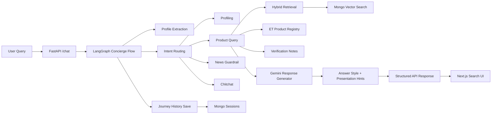
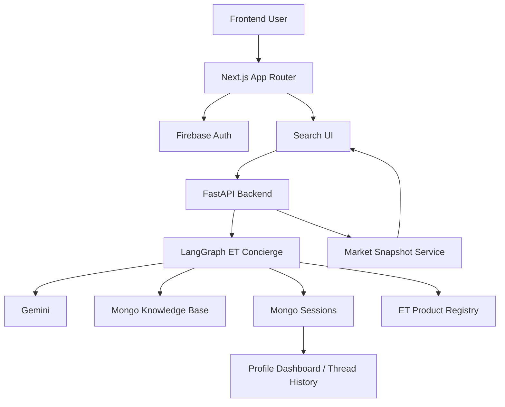
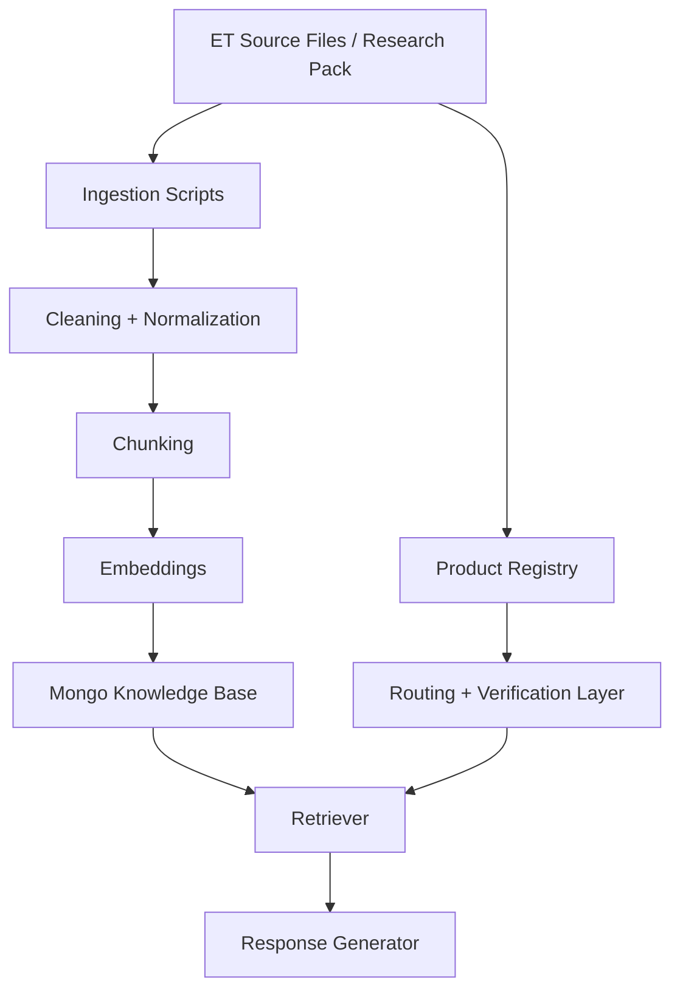

# ET Compass

<p align="center">
  
</p>

<p align="center">
  <strong>LUNA for ET</strong><br />
  The AI concierge front door to the Economic Times ecosystem
</p>

<p align="center">
  <em>RAG-powered discovery, profile-aware routing, verified ET grounding, and selective concierge UI.</em>
</p>

---

> [!IMPORTANT]
> This project is not trying to be “just another chatbot.”
> It is built around the ET hackathon brief: understand the user quickly, guide them into the right ET lane, remember their path, and expose more of the ET ecosystem than users typically discover on their own.

## Table Of Contents

- [What This Project Is](#what-this-project-is)
- [Hackathon Fit](#hackathon-fit)
- [What We Built](#what-we-built)
- [Why The RAG Matters](#why-the-rag-matters)
- [How The RAG Works](#how-the-rag-works)
- [How We Synthesize Answers](#how-we-synthesize-answers)
- [Dynamic Behaviors We Maintain](#dynamic-behaviors-we-maintain)
- [Selective Visual Philosophy](#selective-visual-philosophy)
- [End-to-End Architecture](#end-to-end-architecture)
- [Complete Tech Stack](#complete-tech-stack)
- [Frontend Experience](#frontend-experience)
- [Backend API Surface](#backend-api-surface)
- [Data, Ingestion, And Evaluation](#data-ingestion-and-evaluation)
- [Deployment](#deployment)
- [Local Setup](#local-setup)
- [Repo Structure](#repo-structure)
- [Current Limitations](#current-limitations)
- [Stage-Wise Roadmap](#stage-wise-roadmap)
- [Documentation Trail](#documentation-trail)

---

## What This Project Is

**ET Compass** is a full-stack prototype for the **AI Concierge for ET** problem statement.

The system is designed to:

- greet a user conversationally
- understand their intent, sophistication, and goals
- map them to the right **Economic Times** products and pathways
- answer with grounded ET context instead of vague LLM fluency
- show richer UI only when it truly improves understanding
- preserve journey history so the experience can become more personalized over time

In product terms:

| Layer | Role |
| --- | --- |
| **Next.js frontend** | Landing page, login/signup, profile dashboard, ET concierge interface, selective widgets |
| **FastAPI backend** | API layer, RAG orchestration, market snapshot endpoint, session/history APIs |
| **LangGraph concierge graph** | Profile extraction, routing, retrieval, answer generation, response shaping |
| **Mongo-backed knowledge layer** | Vector retrieval, ET source grounding, session persistence |
| **Firebase auth layer** | Persistent user identity on the frontend |

---

## Hackathon Fit

The core ET problem statement says users only discover a small fraction of the ET ecosystem.

This project directly addresses that by making LUNA:

1. **A conversational ET welcome concierge**
2. **A product/pathway guide instead of a generic assistant**
3. **A profile-aware recommender**
4. **A source-grounded explainer**
5. **A future-ready foundation for cross-sell, financial-life navigation, and voice**

### The strongest product claim we are making

> **We built the AI front door to ET.**

Not:

> “We built a finance chatbot.”

That distinction shaped almost every design decision in this repo.

---

## What We Built

### User-facing product surfaces

- **ET Compass landing page**
- **LUNA search / chat experience**
- **Firebase login and signup**
- **User profile dashboard**
- **Threaded conversation history**
- **Concierge side rails**
- **Selective live-context widgets**
- **Intro and product-branding UI**

### Backend concierge capabilities

- profile extraction from natural conversation
- conservative onboarding questions only when necessary
- registry-aware ET product routing
- hybrid ET retrieval from MongoDB
- verification-aware source citations
- structured journey-history storage
- answer-style control by query type
- presentation hints so the UI does not over-render clutter
- evaluation support for ET-specific prompt packs

---

## Why The RAG Matters

This system works because the answer is not coming from “LLM memory alone.”

The RAG layer is what keeps the product aligned with ET.

Without RAG, the assistant would:

- drift into generic finance advice
- hallucinate ET products or features
- fail to distinguish ET product lanes properly
- over-answer with fluent but weak guidance
- lose the difference between “what ET offers” and “what the internet offers”

With the current RAG stack, LUNA can:

- retrieve ET-grounded context
- combine ET chunks with product-registry facts
- add verification notes for sensitive claims
- decide when to answer directly and when to ask a follow-up
- suppress unnecessary widgets and UI noise

---

## How The RAG Works



### Core backend stages

| Stage | What happens |
| --- | --- |
| **Profile extraction** | Pulls profession, goal, intent, sophistication, and ET-affinity signals from natural language |
| **Routing** | Decides whether the turn is profiling, product query, news request, or chitchat |
| **Retrieval** | Fetches ET knowledge chunks, registry facts, and source metadata |
| **Generation** | Synthesizes an ET-grounded answer shaped for the exact question type |
| **Presentation shaping** | Decides whether the frontend should show products, roadmap, chips, visual panels, or none |
| **History persistence** | Saves route, answer, citations, visual hint, and profile snapshot into session history |

---

## How We Synthesize Answers

This is one of the most important parts of the project.

The backend does **not** just retrieve chunks and dump them into the model.

It synthesizes across multiple layers:

### 1. Retrieved ET context

Knowledge chunks from the vector store provide:

- product descriptions
- source-specific ET facts
- tool pages
- event portals
- benefits pages
- app-store / surface metadata

### 2. Structured ET registry facts

The product registry gives the system a stable canonical map of:

- official ET product names
- aliases and normalization
- category / fit
- summaries
- features
- benefits
- verification state

This is how LUNA stays consistent when users say things like:

- `ET Edge`
- `ET edge events`
- `masterclass`
- `print edition`
- `portfolio`

### 3. User profile state

The same answer changes depending on who is asking.

Examples:

- a beginner/student should not get the same response shape as an active trader
- a broad discovery question should not get the same response as a market-tools question
- a trust-sensitive activation/pricing question should surface caution and verification

### 4. Verification notes

For ambiguous or sensitive ET facts, the assistant can explicitly say:

- public pages show mixed signals
- latest live checkout should be verified
- activation eligibility must be confirmed

### 5. Answer-style control

The backend now classifies the requested answer style and adapts the response:

| Query pattern | Answer style |
| --- | --- |
| latest-news request | `brief` |
| roadmap / 5-day / step-by-step | `roadmap` |
| all ET products / ecosystem overview | `overview` |
| compare / vs / difference between | `compare` |
| deep dive / explain in detail | `detailed` |
| normal ET product question | `standard` |

That means the system can produce:

- a short refusal when live news is unsupported
- a clean ET product overview
- a structured roadmap
- a compact comparison
- a fuller explanation when explicitly requested

---

## Dynamic Behaviors We Maintain

The RAG is not static. It preserves and reacts to conversation dynamics.

### Profile dynamics

The system tracks user signals like:

- profession
- goals
- sophistication
- current lane
- interests
- ET products already mentioned

It also avoids overfilling the profile from weak evidence.

### Route dynamics

Each turn may go through:

- profiling
- product query
- chitchat
- news guardrail

### Presentation dynamics

The backend decides if the frontend should show:

- recommended product badges
- navigator summary
- roadmap card
- quick follow-up chips
- visual panel

### Journey dynamics

Each assistant turn can preserve:

- route taken
- answer text
- answer style
- presentation hints
- recommended products
- citations
- verification notes
- visual hint
- profile snapshot

That makes later stages possible:

- continuity across sessions
- better onboarding memory
- smarter ET cross-sell timing
- richer personalization
- future voice continuity

---

## Selective Visual Philosophy

One of the important UX lessons from the build is this:

> A concierge should not act like a dashboard all the time.

So the rule in this repo is:

```text
If a visual genuinely helps understanding, show it.
If the text answer is enough, do not force extra UI.
```

### Good cases for visual assist

- market tools
- portfolio tracking
- trust / verification flows

### Bad cases for visual assist

- simple product overviews
- short factual ET questions
- unsupported live-news requests
- roadmap responses that are already clear in text

This is why the backend now emits a **presentation contract** instead of leaving all widget decisions to the frontend.

---

## End-To-End Architecture



---

## Complete Tech Stack

### Frontend

| Technology | Role |
| --- | --- |
| **Next.js 16** | App router frontend |
| **React 19** | UI framework |
| **TypeScript** | Type safety |
| **Tailwind CSS** | Styling system |
| **anime.js** | SVG and motion effects |
| **Firebase Web SDK** | User auth and persisted session state |

### Backend

| Technology | Role |
| --- | --- |
| **FastAPI** | HTTP API server |
| **LangGraph** | Multi-step RAG orchestration |
| **LangChain Core** | Messaging and model plumbing |
| **Gemini / Google GenAI** | Extraction and response generation |
| **MongoDB Atlas** | Vector knowledge base + sessions |
| **langchain-mongodb** | Mongo vector search integration |
| **Pydantic** | Request/response validation |
| **yfinance** | Structured market snapshot data for live-context widgets |

### Product and data layer

| Layer | Purpose |
| --- | --- |
| **ET source pack** | Verified ET sources and allow-list |
| **ET product registry** | Canonical ET product definitions |
| **Bootstrap chunk pack** | Seed retrieval data |
| **Evaluation prompts** | Controlled ET benchmark questions |

---

## Frontend Experience

### Landing page

- ET Compass branded hero and product sections
- ET ecosystem cards
- intro video flow
- logged-in avatar state
- CTAs into search/profile

### Search page

- left thread rail
- central conversation area
- right concierge rail
- selective widgets based on backend presentation hints
- real-time style loader and LUNA animation

### Authentication

- email/password signup
- email/password login
- Google sign-in
- persisted signed-in session

### Profile dashboard

- persona snapshot
- goal and sophistication
- recent journey view
- ET lane recommendations

---

## Backend API Surface

### `POST /chat`

Sends a single user message into the ET concierge graph and returns:

- answer
- sources
- source citations
- recommended products
- verification notes
- answer style
- presentation hints
- visual hint
- roadmap when appropriate

### `GET /sessions`

Returns saved session summaries for thread listing.

### `GET /sessions/{session_id}`

Returns a full session document with:

- profile snapshot
- full journey history
- stored turn metadata

### `GET /market-snapshot`

Returns the structured live-context market panel data used by the frontend.

### `GET /health`

Simple backend health status.

---

## Data, Ingestion, And Evaluation

### Ingestion pipeline



### The ingestion path supports

- bootstrap chunk ingestion
- live ET source ingestion
- registry-derived summary records
- metadata-rich chunks
- verification-aware source metadata

### Evaluation goals

- correct ET route selection
- useful citations
- lower hallucination risk
- stronger ET product fit
- safer handling of uncertainty
- consistent answer shape

### Example evaluation run

```bash
cd backend
source .venv/bin/activate
python scripts/run_et_eval.py --limit 40
```

### Why evaluation matters here

RAG quality is not:

> “one answer looked good once”

It is:

- repeatable
- benchmarked
- failure-aware
- improved with controlled passes

---

## Deployment

### Recommended platform split

| Layer | Platform | Why |
| --- | --- | --- |
| **Frontend** | **Vercel** | Best fit for Next.js, simplest preview/prod workflow |
| **Backend** | **Render** | Better fit for a persistent FastAPI + LangGraph + Mongo service than serverless Python functions |

### Why not put the backend on Vercel too?

Vercel is excellent for the Next.js app, but this backend behaves more like a long-lived application service than a tiny serverless function:

- FastAPI API layer
- LangGraph orchestration
- Gemini model calls
- MongoDB vector retrieval
- session history persistence
- market snapshot service

For this prototype, **Render is the safer and simpler backend deployment target**.

### Frontend deployment on Vercel

1. Import the GitHub repo into Vercel
2. Let Vercel detect the project as **Next.js**
3. Keep the root directory as the repo root
4. Add the frontend env vars from [.env.example](./.env.example)
5. Set `NEXT_PUBLIC_API_BASE_URL` to your deployed Render backend URL
6. Deploy

#### Vercel frontend env vars

| Variable | Purpose |
| --- | --- |
| `NEXT_PUBLIC_API_BASE_URL` | URL of the deployed FastAPI backend |
| `NEXT_PUBLIC_FIREBASE_API_KEY` | Firebase web config |
| `NEXT_PUBLIC_FIREBASE_AUTH_DOMAIN` | Firebase auth domain |
| `NEXT_PUBLIC_FIREBASE_PROJECT_ID` | Firebase project id |
| `NEXT_PUBLIC_FIREBASE_STORAGE_BUCKET` | Firebase storage bucket |
| `NEXT_PUBLIC_FIREBASE_MESSAGING_SENDER_ID` | Firebase messaging sender id |
| `NEXT_PUBLIC_FIREBASE_APP_ID` | Firebase app id |
| `NEXT_PUBLIC_FIREBASE_MEASUREMENT_ID` | Firebase analytics id |

### Backend deployment on Render

This repo includes a ready Render blueprint at [render.yaml](./render.yaml).

You can deploy either:

- from the Render dashboard manually, or
- from the blueprint config in the repo

#### Manual Render service settings

| Setting | Value |
| --- | --- |
| **Root Directory** | `backend` |
| **Runtime** | `Python` |
| **Build Command** | `pip install -r requirements.txt` |
| **Start Command** | `uvicorn app.main:app --host 0.0.0.0 --port $PORT` |
| **Health Check Path** | `/health` |

#### Render backend env vars

Use [backend/.env.example](./backend/.env.example) as the base.

| Variable | Required | Purpose |
| --- | --- | --- |
| `GOOGLE_API_KEY` | Yes | Gemini / Google model access |
| `MONGODB_URI` | Yes | MongoDB Atlas connection |
| `EMBEDDING_MODEL` | Yes | Embedding model name |
| `GOOGLE_CHAT_MODEL` | Recommended | Primary chat model |
| `MONGODB_DB_NAME` | Yes | Database name |
| `MONGODB_KNOWLEDGE_COLLECTION` | Yes | Knowledge collection |
| `MONGODB_PERSONA_COLLECTION` | Yes | Persona collection |
| `MONGODB_SESSIONS_COLLECTION` | Yes | Sessions collection |
| `MONGODB_VECTOR_INDEX` | Yes | Vector index name |
| `ALLOWED_ORIGINS` | Yes | Comma-separated frontend origins allowed by CORS |

### CORS for production

The backend now reads `ALLOWED_ORIGINS` from environment variables.

Example:

```text
ALLOWED_ORIGINS=http://localhost:3000,http://127.0.0.1:3000,https://your-vercel-project.vercel.app
```

This is required so your deployed Vercel frontend can call the Render backend.

### Firebase production checklist

In Firebase Console:

- enable `Email/Password`
- enable `Google`
- add `localhost` to authorized domains for local development
- add your Vercel production domain to authorized domains

### Recommended go-live order

1. Deploy the backend to Render
2. Copy the Render URL
3. Set `NEXT_PUBLIC_API_BASE_URL` in Vercel
4. Deploy the frontend to Vercel
5. Add the Vercel domain to:
   - Firebase authorized domains
   - backend `ALLOWED_ORIGINS`

### Deployment files included in this repo

| File | Purpose |
| --- | --- |
| [.env.example](./.env.example) | Frontend env template |
| [backend/.env.example](./backend/.env.example) | Backend env template |
| [render.yaml](./render.yaml) | Render blueprint for the backend |
| [vercel.json](./vercel.json) | Explicit Vercel frontend config marker |

---

## Local Setup

### Frontend

```bash
npm install
npm run dev
```

### Backend

```bash
cd backend
source .venv/bin/activate
pip install -r requirements.txt
uvicorn app.main:app --reload --host 127.0.0.1 --port 8000
```

### Quick health check

```bash
curl http://127.0.0.1:8000/health
```

### Environment notes

#### Frontend expects

- `NEXT_PUBLIC_API_BASE_URL`
- Firebase public config values

#### Backend expects

- Google API key
- embedding model name
- MongoDB URI
- ET knowledge already ingested or available for ingestion

---

## Repo Structure

```text
ET-Concierge/
├── backend/
│   ├── app/
│   │   ├── chatbot/
│   │   │   ├── agents.py
│   │   │   ├── graph.py
│   │   │   ├── retriever_service.py
│   │   │   ├── registry.py
│   │   │   ├── ingestion.py
│   │   │   ├── market_data.py
│   │   │   ├── service.py
│   │   │   └── state.py
│   │   └── main.py
│   ├── scripts/
│   ├── eval_results/
│   ├── EXPLANATION.md
│   └── requirements.txt
├── public/
├── src/
│   ├── app/
│   ├── components/
│   ├── content/
│   └── lib/
└── README.md
```

---

## Current Limitations

- LUNA is **not yet** a true live-news bot
- general current-affairs retrieval is still guarded rather than fully supported
- backend session history is richer than backend user binding; full Firebase `uid` linkage can go deeper
- some widget layers are still hackathon-MVP grade
- voice concierge is not added yet
- financial-life navigator depth is still earlier than the final vision

---

## Stage-Wise Roadmap

### Stage 1

- working ET concierge chat
- profile-aware routing
- ET product discovery
- verified citations

### Stage 2

- stronger corpus
- registry-aware retrieval
- evaluation packs
- selective widgets
- cleaner answer shaping

### Stage 3

- deeper financial-life navigation
- better session intelligence
- improved ET cross-sell logic
- stronger journey prediction

### Stage 4

- real user-linked backend identity
- richer profile memory
- higher-fidelity ET service workflows

### Stage 5

- voice concierge
- multimodal interactions
- stronger real-time ET path continuity

---

## Documentation Trail

- Root system overview: [README.md](./README.md)
- Plain-English backend change log: [backend/EXPLANATION.md](./backend/EXPLANATION.md)

<details>
<summary><strong>Why this repo matters</strong></summary>

This prototype demonstrates that the ET concierge idea is viable when three things are combined properly:

- a grounded ET-specific RAG layer
- a disciplined UI that knows when not to over-render
- a product mindset that optimizes for guidance, not just answers

</details>

---

<p align="center">
  <strong>ET Compass</strong><br />
  Built to help users discover more of ET through one intelligent conversation.
</p>
