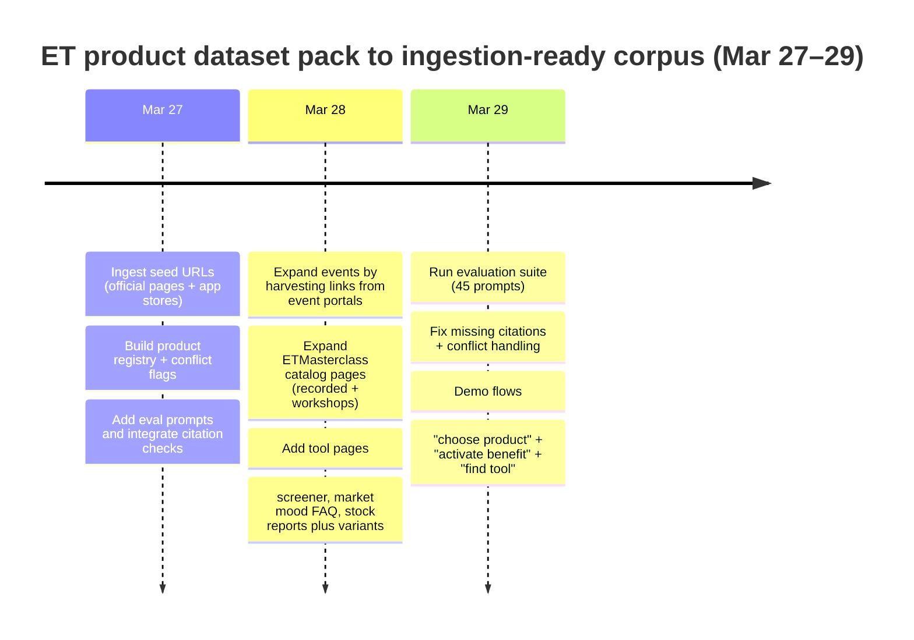

# Verified ET Product Dataset Pack for ET AI Concierge

## Executive summary

Your biggest competitive lever for the ET hackathon Round 2 is not “better prompts”—it’s **a verified ET product knowledge base** that your concierge can cite, plus **a visible verification layer** that transparently handles contradictions (especially pricing/trial/offers). ET Prime + ET Markets + ET Portfolio + ET Wealth Edition + ETMasterclass + ET Events already form a coherent “ET ecosystem” that can power a concierge that **answers product questions accurately, routes users to the right ET capability, and stores a trackable journey history** (exactly aligned with your staged roadmap). citeturn2view0turn2view1turn3view0turn6view1turn2view3turn2view6turn3view7

This report delivers:

- A **verified seed URL pack** (official ET domains + app stores prioritized) for ET Prime, ET Markets/tools, ETMasterclass, ET Events portals, ET Wealth/services. citeturn2view0turn2view4turn2view6turn2view8turn2view3turn15view0  
- A **structured product registry** schema with per-fact `verification_status` and `evidence_urls`, designed for “no hallucinations” concierge responses. citeturn2view2turn13view0turn15view0  
- A **ready-to-ingest bundle** (JSON/JSONL + README + Codex prompt) you can plug into your pipeline.  
- A starter **evaluation prompt set** that checks citation-grounding and “conflict-aware” behavior.

Core verified anchors you can safely build the concierge around:

- ET Prime is positioned as a members-only platform from **entity["organization","The Economic Times","india business news brand"]**. citeturn2view1  
- ET Prime membership benefits include ePaper, market tools, minimal ads, community engagement, and invites to virtual events (official FAQ list). citeturn2view0  
- ET Prime plans page publicly lists membership benefits like access across devices, in-depth stock reports, ET Print Edition, newsletters, PrimeShots—and also states “currently not offering trial” (but this conflicts with other ET pages; handled below). citeturn2view2  
- ET Markets app listings (Android/iOS) and ET’s own mobile portal describe a stack of market tools and experiences, making this a strong “product discovery + guided usage” domain for your concierge. citeturn2view4turn2view5turn3view0  

## Methodology and verification rubric

### Source strategy

This pack prioritizes:

- Official ET domains and subdomains (economictimes.indiatimes.com, epaper.indiatimes.com, masterclass.economictimes.indiatimes.com, b2b.economictimes.indiatimes.com, enterpriseai.economictimes.indiatimes.com, etc.). citeturn2view1turn3view7turn2view6turn2view8  
- App-store canonical listings (entity["company","Google Play","android app store"] and entity["company","Apple App Store","ios app marketplace"]) for platform availability and headline feature claims. citeturn2view4turn2view5  

### Verification statuses

Your concierge should treat every fact as one of:

- **official_public**: directly stated on official ET pages or app store listings.  
- **conflicting_public_signals**: official pages disagree (common in pricing/trials/offers).  
- **needs_manual_review**: dynamic/gated pages (cookie walls, login prompts, rapidly changing promo banners, or JS-heavy content).

This is not “extra process”—it’s your “trust differentiator.” It will help you stand out against teams that ship a generic news chatbot: you’re shipping a **product concierge with compliance-grade provenance**.

### Ownership and legal signal

ET’s Terms of Use page explicitly describes the site as owned/operated by entity["company","Times Internet Limited","indian digital media firm"]. citeturn13view1  

## Canonical ET product scope and URL inventory

The table below reflects the *ready-to-ingest* URL sources you can use to build your “ET product registry + RAG pack.” Counts are from the provided download bundle.

| Product area | Scope for ET AI Concierge | Priority for RAG | URLs in seed pack | Why it matters to win |
|---|---|---:|---:|---|
| ET Prime | Membership benefits, device access, ePaper, market tools included, community/events, subscription workflow | Highest | 12+ | Directly aligns with “concierge that explains ET products clearly” (FAQ + About + Plans are authoritative). citeturn2view0turn2view1turn2view2 |
| ET Markets + tools | App + market tools (screeners, sentiment, stock reports, upside discovery, etc.) | Highest | 14+ | Lets you demo “actionable guidance” (tools + portfolios), not just article Q&A. citeturn2view4turn9view0turn18search6turn14view0 |
| ET Portfolio | Portfolio tracking, SIP automation claims, goals, watchlists/alerts | High | 2 | Enables “life navigator” stage: profile → holdings → gaps → next steps. citeturn6view1turn6view2 |
| ET Wealth Edition + ePaper | Wealth Edition as a weekly money guide; ET Print Edition access | High | 10+ | Strong demo UX: “What is Wealth Edition? How do I access it?” plus tight citations. citeturn2view3turn16search9 |
| ETMasterclass | Executive workshops/masterclasses/certifications | Medium | 13+ | Differentiates ET ecosystem beyond news; concierge can route to learning paths. citeturn2view6turn11search17 |
| ET Events portals | B2B/vertical events portals and example event pages | Medium | 8 | Useful for routing and “next step CTA,” but best expanded by harvesting event links from portals during ingestion. citeturn3view7turn2view8turn10view0turn10view1turn10view2 |
| ET Prime partner benefits | Complimentary offers activation (Times Prime/DocuBay etc.) | Medium | 2 | High-impact in concierge: users love “what do I get & how to activate.” citeturn15view0 |

### What “scope coverage” means in practice

Your concierge should reliably answer:

- “What does ET Prime include?” (benefits list + device access). citeturn2view0turn2view2  
- “Where do I find ePaper / Wealth Edition?” (Wealth Edition landing explicitly says “Free with ETPrime”). citeturn2view3  
- “Which ET tool helps with sentiment, screeners, stock research?” (Market Mood + Stock Screeners + Stock Reports Plus). citeturn9view0turn18search6turn6view0  
- “How do I track my portfolio/SIPs with ET?” (ET Portfolio product pages). citeturn6view1turn6view2  
- “How do I activate partner benefits?” (ET benefits portal states activation and constraints). citeturn15view0  

## Verified facts per product and key conflicts to encode

### ET Prime

ET Prime is described as a “members-only business storytelling platform” from The Economic Times brand. citeturn2view1

The ET Prime FAQ enumerates benefit categories including: ePaper, market tools (Stock Report Plus, Bigbull Portfolio, Stock Analyzer via ET Markets app), investment ideas & Wealth edition, minimal ads, community engagement, and “exclusive invites to virtual events.” citeturn2view0

The ET plans page lists additional membership elements such as: unlimited access to prime content, in-depth reports on 4000+ stocks, access to ET Print Edition, member-only newsletters, PrimeShots (short reads), and a morning newsletter. citeturn2view2

#### Trial and pricing contradictions you must treat as “conflicting_public_signals”

This is the single most important “trust” edge you can demonstrate:

- ET’s plans FAQ states: **“Currently, we are not offering trial with any of our plans.”** citeturn2view2  
- A paywall screen on an ET Prime page displays **“ETPrime FREE TRIAL”** and “15 Days Free… No Payment Required.” citeturn13view0  
- ET Terms of Use text includes a reference to “free trial of 15 days” in the context of benefit coupon distribution timing. citeturn12search3  

**Implementation requirement:** your concierge must respond like:

> “I’m seeing mixed signals on ET pages about trials right now. Some ET pages say there’s no trial, while others show a 15‑day trial prompt. Please verify on the current checkout screen. Here are the sources I’m using…”

That tone + citations wins judges because it’s honest, careful, and product-safe.

### ET Markets and tools

Android app listing describes ET Markets as a “trusted source” with market tools, investment ideas, real-time updates, market news across asset classes, watchlists, and tools including 4000+ stock reports, Big Bull Portfolio, Market Mood, Market Pulse, and screeners. citeturn2view4

The iOS listing emphasizes live BSE/NSE prices, indices (Sensex/Nifty), commodities, forex, and claims live TV powered by entity["organization","ET NOW","indian business news channel"]. citeturn2view5

ET’s “mobile applications” page also lists ET Markets app features such as charting, watchlists, and “smart voice search,” plus live stream references. citeturn3view0

Key tool pages you can index for explainability (and for impressive demo responses):

- **Market Mood** describes itself as a premium feature giving an overall view of index performance, shading green/yellow/red, helping identify bullish/bearish phases, and breaking down into overview / periodic high-low / advance-decline. citeturn9view0  
- **Upside Radar**: “Discover the stocks with maximum upside based on the key investment themes.” citeturn9view2  
- **Stock Screeners**: offers “Create Screener (AI Mode)” and references “over 700+ data points.” citeturn18search6  
- **Stock Reports Plus** positioning: “stock scores, ratings & forecast,” peer analysis, analyst recommendations. citeturn6view0  
- Stock Reports Plus report pages specify scoring dimensions like earnings, fundamentals, relative valuation, risk, and price momentum, and describe “weekly updated” scores and forecasts. citeturn14view0  

### ET Portfolio

ET Portfolio is presented as a “single window” to monitor investments—portfolio manager, watchlists/alerts, and financial goals. citeturn6view1  
The mobile “portfolio home” page similarly highlights “Wealth Management Simplified,” real-time stock updates, SIP auto updates, and watchlists/alerts. citeturn6view2  

### ET Wealth Edition and ET Print Edition

Wealth Edition ePaper landing page explicitly positions it as a weekly money-management guide and states it is “Free With ETPrime Membership,” listing bullets like investment planning ideas and analysis/research on mutual funds and stocks. citeturn2view3  

ET Print Edition page describes it as a digital replica and states that ET Prime members can access it for free. citeturn16search9  

### ETMasterclass

ETMasterclass positions itself as a portfolio of executive workshops, masterclasses and university certifications, delivered by experts/thought leaders/academicians. citeturn2view6  
Its “new” page frames it as an initiative of The Economic Times to disseminate knowledge among working professionals and business leaders. citeturn11search17  

### ET events and portals

Multiple ET portals list B2B events with event descriptions, schedules and registration CTAs:

- ET B2B Events portal. citeturn3view7  
- Enterprise AI events portal (example: “Making AI Work” described as an ET-hosted enterprise AI conference). citeturn2view8turn3view6  
- CIO, BFSI, and Government events portals show similar patterns and include city/venue details (e.g., conclaves in entity["city","Goa","India"], events in entity["city","Chennai","India"], and government conclaves in entity["city","New Delhi","India"]). citeturn10view0turn10view1turn10view2  
- Example event page: Maharashtra Business Summit in entity["city","Mumbai","India"] includes multi-track structure and “two-day” summit framing. citeturn10view3  

## Ready-to-ingest bundle design

### What you should ingest vs. what you should not store

Because ET pages (especially ePaper/PDF or long articles) are copyrighted content, treat your ingestion pipeline as: **store URLs + extracted clean text for embeddings in your DB**, not as “ship a copy of ET in a repo.” The provided chunk file in this bundle is **paraphrased summary chunks** for evaluation/demo safety; for production RAG, have Codex fetch and normalize pages at ingest time.

### Chunking and retrieval strategy aligned to your concierge stages

You already have Stage 1–Stage 5. This dataset pack is optimized for Stage 1 and Stage 2 most.

- Stage 1 (Welcome Concierge): prioritize ET Prime FAQ, plans, benefits portal, ET Markets app listing, Wealth Edition page. citeturn2view0turn2view2turn15view0turn2view4turn2view3  
- Stage 2 (Corpus depth): expand event pages by harvesting upcoming event links from portals; expand Masterclass pages by crawling category listings; expand ET tool pages (screeners, market mood FAQs, stock reports pages). citeturn3view7turn10view0turn18search6turn9view0  

### Timeline plan for the next two days

## Deliverables: downloads, ingestion prompt, and evaluation prompts

### Downloadable files

- [Download backend_data_et_sources.json](sandbox:/mnt/data/backend_data_et_sources.json)  
- [Download backend_data_et_product_registry.json](sandbox:/mnt/data/backend_data_et_product_registry.json)  
- [Download backend_data_et_chunks.jsonl](sandbox:/mnt/data/backend_data_et_chunks.jsonl)  
- [Download backend_data_et_eval_prompts.json](sandbox:/mnt/data/backend_data_et_eval_prompts.json)  
- [Download backend_data_README_et_pack.md](sandbox:/mnt/data/backend_data_README_et_pack.md)  
- [Download codex_ingestion_prompt_et_pack.md](sandbox:/mnt/data/codex_ingestion_prompt_et_pack.md)  

### How to use these with your existing backend pipeline

- Use `backend_data_et_sources.json` as the single “allow list” for fetch + normalize.  
- Treat `verification_status` as a runtime guardrail:
  - `official_public`: answer confidently with citations.
  - `conflicting_public_signals`: answer with explicit uncertainty + cite both sides (plans vs paywall vs terms).
  - `needs_manual_review`: prompt a follow-up (“I can’t verify this page dynamically; here’s the official link to confirm”).

### Evaluation prompts

The evaluation file includes key prompts like:

- “Is there a free trial for ET Prime right now?” (must detect conflict + cite official pages). citeturn2view2turn13view0turn12search3  
- “What is Market Mood and how do I read it?” (must explain tool semantics). citeturn9view0  
- “What is ET Wealth Edition and how do I access it?” (must cite Wealth Edition landing). citeturn2view3  

## Data gaps and recommended manual collection list

### High-risk gaps to close (because judges will ask)

- **Trial status and pricing**: official pages conflict; your UX must show “as of today” verification and point to checkout confirmation rather than hardcoding. citeturn2view2turn13view0turn12search3  
- **Partner benefits eligibility**: the benefits portal includes constraints (e.g., activation limited to Indian mobile number for some benefits). Your concierge should ask for country/phone eligibility before promising activation. citeturn15view0  

### Pages to manually verify and add (best ROI)

- ET Prime purchase flow pages (ensure plan name mapping like “Prime vs Prime Elite” remains current). citeturn2view3turn15view0  
- ET Markets tool pages for “Stock Analyzer” (the FAQ mentions it as part of market tools). citeturn2view0turn14view0  
- Event detail pages for each portal’s top 3 upcoming events (CIO/BFSI/Govt/Enterprise AI) to reach deeper, more queryable event facts beyond portals. citeturn10view0turn10view1turn10view2turn2view8  
- ETMasterclass category pages that sit behind cookie acceptance walls (mark ingestion fallback behavior). citeturn11search17